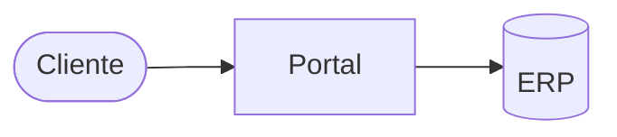

## Pedido e problema

A Acme recebe pedidos por e-mail e planilha. Quer um **portal de pedidos** com catálogo, carrinho e pagamento.

## Resultado esperado

- [x] Clientes fazem pedidos sem e-mail.
- [ ] Pagamento aprovado em até 1 minuto.

## Contexto e evidências

| Canal | Pedidos por mês | Erros |
| --- | ---: | ---: |
| E-mail | 320 | 41 |
| Planilha | 120 | 9 |

Ver o projeto [[Projetos/Acme/AC-P001 - Portal de pedidos/AC-P001 - Portal de pedidos|AC-P001 - Portal de pedidos]] e a [[Clientes/C001 - Acme|ficha da Acme]].

## Impacto e risco

Atrasos de entrega por pedidos digitados errado.

## Perguntas abertas

- Qual gateway de pagamento?

## Encaminhamento

`implementation_plan`: escopo claro e aprovado.

## Auditoria

- `2026-09-02T14:00:00-03:00` | Samuel Fiais | created | — | discovered | pedido recebido por e-mail
- `2026-09-03T09:10:00-03:00` | agent:claude | status_change | discovered | needs_clarification | falta definir o gateway
- `2026-09-04T16:30:00-03:00` | agent:claude | status_change | needs_clarification | ready | Samuel confirmou o escopo
