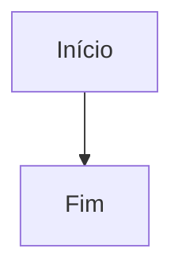

# {{code}} - {{name}}

## Objetivo

_O que este diagrama deve tornar compreensível._

## Diagrama

## Legenda

_Explique siglas, cores, linhas ou limites relevantes._

## Premissas e perguntas abertas

- _Premissa confirmada ou pergunta pendente._

## Fontes

- _Wikilink para cada documento que sustenta o diagrama._

## Auditoria

- `{{iso8601}}` | {{actor}} | created | — | {{status}} | criação do registro

