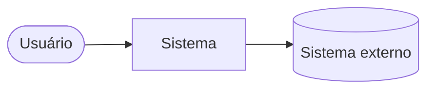

# {{code}} - {{system_name}}

## Propósito

_O que o sistema faz, para quem, e de onde vem esta arquitetura (decisão, sistema existente, referência reaproveitada)._

## Contexto

_Usuários e sistemas externos com que o sistema conversa, e o que troca com cada um._

Remova o diagrama se ele não acrescentar nada às tabelas.

## Componentes

| Componente | Tipo | Responsabilidade | Tecnologia |
| --- | --- | --- | --- |
| _[[<código>-C001 - Componente\|Componente]] ou nome_ | _application_ | _o que faz_ | _stack_ |

## Stack

| Camada | Tecnologia | Versão | Observação |
| --- | --- | --- | --- |
| _Backend_ | _Framework_ | _x.y_ | _motivo ou restrição_ |

## Integrações

| Integração | Direção | Protocolo e formato | Situação |
| --- | --- | --- | --- |
| _Sistema externo_ | _entrada/saída_ | _REST/JSON, arquivo, fila_ | _ativa, prevista, fora do escopo_ |

## Dados e armazenamento

_Onde os dados ficam (banco, storage de arquivos, cache), o que vai para cada lugar, retenção e o que é exportado. Entidades e regras ficam no domínio._

## Infraestrutura e ambientes

| Ambiente | Onde roda | Hosts e portas | Implantação |
| --- | --- | --- | --- |
| _Desenvolvimento_ | _máquina, provedor_ | _0.0.0.0:7050_ | _comando, pipeline_ |

## Segurança

_Autenticação, autorização, segregação de dados, tratamento de segredos, criptografia em trânsito e em repouso, auditoria._

## Requisitos não funcionais

_Metas decididas de desempenho, disponibilidade, capacidade, offline, recuperação. Registre só o que foi decidido ou medido._

## Decisões arquiteturais

- _[[<decisão>|<código>]] — escolha que a decisão define._

## Fonte no código

- _Repositório, caminhos e versão (commit) de onde a arquitetura foi lida._

## Projetos

- _Projetos que usam ou evoluem esta arquitetura._

## Repositórios

- _Repositórios que implementam o sistema._

## Questões abertas

- _Dúvida sobre a arquitetura, quando `confidence` não for `confirmed`._

## Fontes

- _Decisão, reunião, código ou documento que alimentou a arquitetura._

## Auditoria

- `{{iso8601}}` | {{actor}} | created | — | proposed | criação da arquitetura
