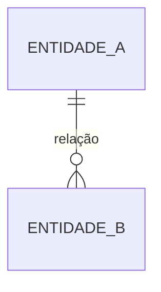

# {{code}} - {{domain_name}}

## Propósito e fronteira

_Qual parte do negócio este domínio modela, em uma ou duas frases._

- **Dentro:** _o que pertence a este domínio._
- **Fora:** _o que parece relacionado, mas pertence a outro domínio ou a nenhum._

## Entidades

| Entidade | Papel no domínio | Status |
| --- | --- | --- |
| _[[<código>-E001 - Entidade\|Entidade]]_ | _o que ela representa aqui_ | _proposed_ |

## Modelo

## Relação com outros domínios

- _[[<código> - Outro domínio\|Outro domínio]]: o que é fornecido ou consumido e como os termos se traduzem._

Remova esta seção quando não houver dependência entre domínios.

## Projetos

- _Projetos que usam ou alteram este domínio._

## Questões abertas

- _Dúvida sobre fronteira ou modelo, quando `confidence` não for `confirmed`._

## Fontes

- _Demanda, reunião, plano, task ou documento que alimentou o domínio._

## Auditoria

- `{{iso8601}}` | {{actor}} | created | — | proposed | criação do domínio
