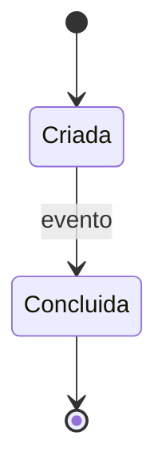

# {{code}} - {{entity_name}}

## Papel no domínio

_O que esta entidade representa neste domínio. A definição da palavra fica no termo do vocabulário; aqui, só o que é específico do domínio._

## Atributos

| Atributo | Significado | Obrigatório | Observação |
| --- | --- | --- | --- |
| _atributo_ | _o que o negócio guarda_ | _sim/não/a confirmar_ | _origem, restrição ou dúvida_ |

## Relacionamentos

| Entidade | Cardinalidade | Natureza |
| --- | --- | --- |
| _[[<código>-E002 - Outra\|Outra]]_ | _1:N_ | _uma entidade tem várias outras_ |

## Ciclo de vida

| De | Para | Gatilho | Quem |
| --- | --- | --- | --- |
| _estado_ | _estado_ | _evento ou ação_ | _papel_ |

Remova esta seção quando a entidade não tiver estados relevantes.

## Invariantes

- _Condição que deve ser sempre verdadeira. — fonte ou [[RN]]_

## Mudanças propostas

- _Alteração ainda não confirmada, com a fonte. Usada só quando a entidade estiver `active`._

## Questões abertas

- _Dúvida sobre atributo, relação, estado ou invariante._

## Fontes

- _Demanda, reunião, plano, task ou documento que alimentou a entidade._

## Auditoria

- `{{iso8601}}` | {{actor}} | created | — | proposed | criação da entidade
